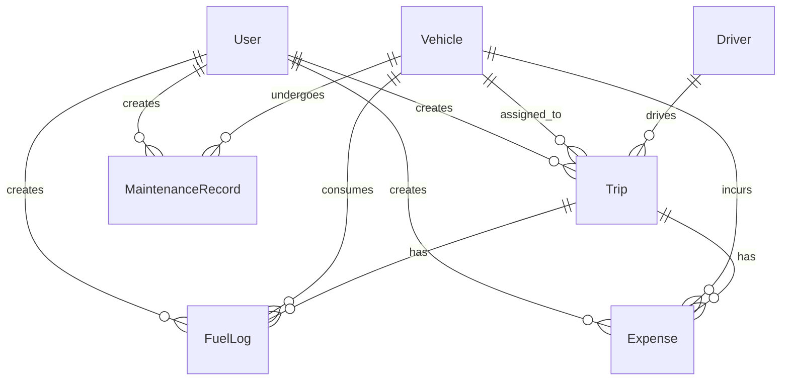

# Entity Relationship Diagram

This document contains the Entity Relationship (ER) diagram for the TransitOps system.

```mermaid
erDiagram
    User ||--o{ Trip : "creates"
    User ||--o{ MaintenanceRecord : "creates"
    User ||--o{ FuelLog : "creates"
    User ||--o{ Expense : "creates"

    Vehicle ||--o{ Trip : "assigned_to"
    Vehicle ||--o{ MaintenanceRecord : "undergoes"
    Vehicle ||--o{ FuelLog : "consumes"
    Vehicle ||--o{ Expense : "incurs"

    Driver ||--o{ Trip : "drives"

    Trip ||--o{ FuelLog : "has"
    Trip ||--o{ Expense : "has"
```
